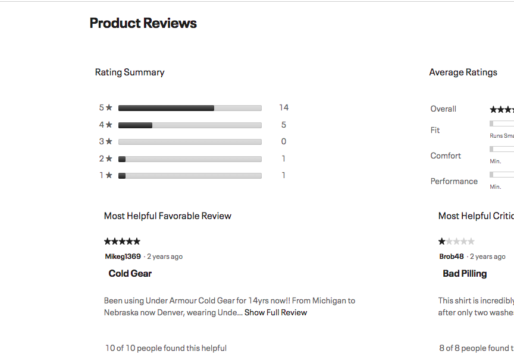
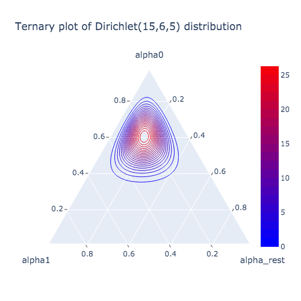
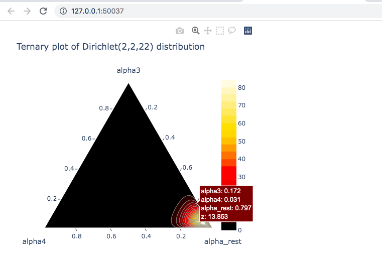
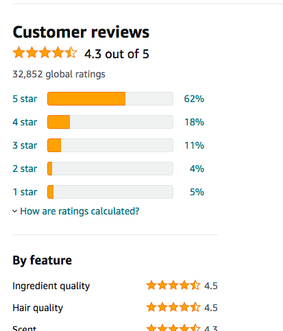
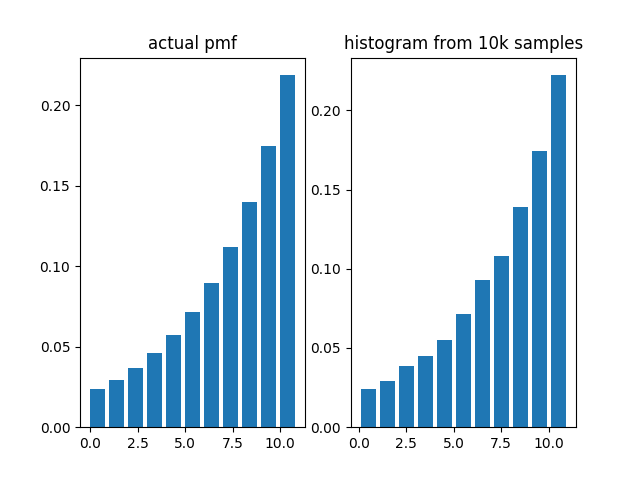
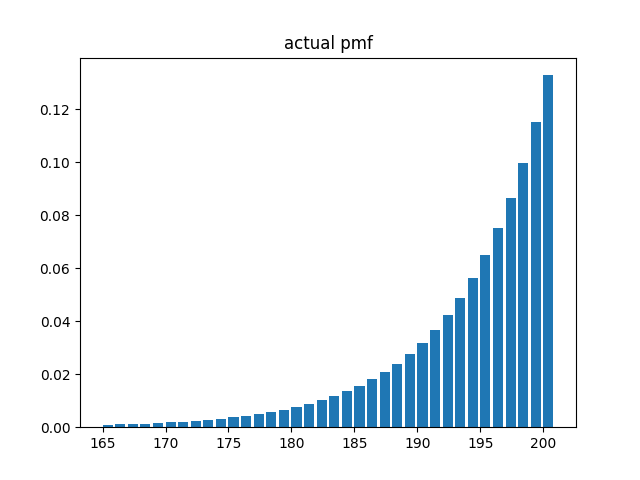

# RatingsModel
A Bayesian hypothesis testing tool which determines the significance of user rating differences.


## Background
Suppose you have a user ratings distribution for a product you're looking to buy, or maybe the responses from a survey you've conducted. Given the counts for each category, how does one assess the significance of the differences between these counts? 

This tool helps infer the answer to that question! At a high level, RatingsModel smoothes the observed counts with a multinomial distribution and calculates the probability that the sampled counts for the (observed) highest voted category are greater than the sampled counts of all the other categories, assuming the event of assigning and aggregating ratings is repeated "in alternate, independent universes" with the same (or about the same) frequencies[^1]. One minus this probability is the p-value of the test with a null hypothesis that there are no significant differences.

[^1]: That is, ratings given on an individual level are "drawn out of a box" with those frequencies.

## Details on Usage and Implementation
For situations where the total number of responses is low, the observed proportions for each category will be crude approximations, therefore a Dirichlet prior (which is conjugate to the Multinomial distribution) on the proportions may be imposed to regularize those approximations, adding noise to the proportions for each hypothetical event where individual ratings are assigned and aggregated. You do this by using the monte carlo version of the test ``monte_carlo_test``, a monte carlo approximation of the p-value, with ``sample_from_prop_prior = True``. 

For situations where the total number of responses is high, the observed proportions will be good approximations, and the Dirichlet prior may be dropped. Either call the method ``monte_carlo_test`` with ``sample_from_prop_prior = False``, or use the ``exact_test``. Mathematically, the exact p-value calculation involves a summation over integer partitions, which is done by utilizing two fast and memory efficient algorithms to calculate these partitions, as well as the ``multiprocessing`` module to distribute the workload over multiple cores. A fast computer with many cores or a good cloud computing instance is recommended for this. Without a good machine, you may find it easier to estimate the p-value instead, by trading imprecision over speed via ``monte_carlo_test``, setting ``sample_from_prop_prior = False`` and ``sample_from_count_prior = False``. 

You may also wish to impose a count prior on the total number of responses, to sample from it for each hypothetical event where individual ratings are assigned and aggregated. You would want to do this if you think the turnout is expected to fluctuate according to some distribution, queue or process, time dependent or not, and you wish to include this information in your inference. This is important since the turnout will influence the scale at which differences are significant[^2]. 

For example, what if there is great incentive for every (or almost every) person to submit their response to a question in a survey, while accounting for the busyness of everyday life? In that case, you'd want to use some heavy tailed discrete distribution, concentrated on the side of 100% turnout. For this purpose, ``RatingsModel`` comes with a ``RightGeometricCountPrior`` class, whose masses follow a geometric sequence. A nice feature of this distribution is that parameters can be estimated given a confidence interval. Perhaps, you are 95% sure that the turnout will be somewhere within 180 and 200 (200 being the max possible along the distribution's support; the number of surveys sent out)? The estimation works by finding a root via Newton's method, which starts at an inflection point and continues off with a consistent decreasing slope from right to left, guaranteeing quadratic convergence. Sampling from this distribution is also very efficient, done by applying a numpy-vectorized transformation to uniform random variables, amounting to 100% acceptance and 0% rejection. You are free to use include it, or define your own count prior distribution class![^3]

[^2]: For example, suppose you have a turnout of 100. A difference of 30 between the two highest voted categories seems significant. Now, what if the turnout is 500? It may be hard to tell if 30 is a big difference on this scale. 

[^3]: Your count prior class must have a ``count_rvs()`` method with an argument called ``size``, specifying the number of samples to draw. The input is an integer, and output must be a one-dimensional numpy array of random variables. 

## Examples
### Header
To import the model itself, as well as an optional count prior, which comes with the package.
```python
from Ratings import RatingsModel
from count_priors import RightGeometricCountPrior # optional
```
<br> <br />
### Number of Total Responses is Low
Let's say we want to purchase some running gear and see the following user ratings distribution:
<p align="middle">
  
   
</p>
Is there a strong, statistically significant, public consensus at 5 stars? This is the same as asking: how small is one minus the probability that people have a 5 star preference over the other stars?  
<br> <br />
Create an instance of the model:

```python
model = RatingsModel()(observed_counts = [14,5,0,1,1])

```
There's a total of only 21 responses, so we'll allow a Dirichlet prior on the observed proportions [14/21, 5/21, 0/21, 1/21, 1/21] and run a monte carlo approximation of the p-value, with the default ``num_samples = 1_000`` and treating the total number of responses as fixed. The default output is a 95% confidence interval (the p-value is asymptotically normal by the Central Limit Theorem):

```python
print(model.monte_carlo_test(sample_from_prop_prior = True, sample_from_count_prior = False)) 
# outputs (0.09707853036985647, 0.1369214696301435)
```
<br> <br />

#### Changing Defaults
We could always increase ``num_samples`` if we want a tighter estimate:

```python
print(model.monte_carlo_test(sample_from_prop_prior = True, sample_from_count_prior = False, num_samples = 10_000)) 
# outputs (0.10505451077446598, 0.10625948922553402)
```

Or if we want a 99% confidence interval instead:
```python
print(model.monte_carlo_test(sample_from_prop_prior = True, sample_from_count_prior = False, num_samples = 10_000, confidence = 0.99)) 
# outputs (0.09855417196237032, 0.11444582803762976)
```
<br> <br />
Conclusion: It looks like there isn't enough evidence to conclude that people will give the product 5 stars over other stars!
<br> <br />

> :warning:  **Running the exact test under low total scenarios will lead to conflicting results!**
> ```python
> print(model.exact_test()) # outputs to 0.01842333675483565
> ```

<br> <br />
#### Dirichlet Prior Visualization
The Dirichlet prior lies on a 4-[simplex](https://en.wikipedia.org/wiki/Simplex), which is hard to visualize. However, we can inspect a 2-simplex instead, by marginalizing over the other variables. The marginal distribution over the first and second proportion in the list is also a Dirichlet:
```python
model.render_figure(element_pair = [0,1], output = 'image')
```
<p align="middle">
  
</p>

It looks like there is some noticeable variability around the first and second proportion, which feature the highest counts. It was wise that the proportions were regularized.

<details><summary>How to read the ternary plot</summary>
<p>

>The alpha corresponding to each side of the triangle is read counterclockwise. The alpha0 axis is the left leg of the triangle while the alpha1 axis is the bottom leg. 
>
>You can look at the various points along the support of this distribution by connecting the lines intersecting from each axis. The numbers where those lines originate always add up to 1. For example, when alpha0 = 0.6 and alpha1 = 0.2 (consequently alpha_rest = 1 - 0.6 - 0.2 = 0.2) it's close to the hotspot, or mode of the dirichlet prior.

</p>
</details>
<br> <br />

You can modify or add to the plotting parameters of this method. Refer to the [full function definition](https://plotly.com/python-api-reference/generated/plotly.figure_factory.create_ternary_contour.html). You can also make the plot interactive by running it in your web browser:
```python
model.extra_plotting_params = {'colorscale':'Hot'}

# renders a filled ternary plot of the last 2 proportions
model.render_figure(element_pair = [3,4], output = 'web browser')
```
<p align="middle">
  
</p>


### Number of Total Responses is High
This shampoo looks promising with its total number of ratings and ratings distribution!
<p align="middle">
  
   
</p>
Once again, is there a strong, statistically significant, public consensus at 5 stars? This is the same as asking: how small is one minus the probability that people have a 5 star preference over the other stars?
<br> <br />

#### Different ways to instantiate
Create an instance of the model via an alternative constructor:

```python
model = RatingsModel().from_percentages_and_total(total = 100, 
                            observed_percentages = [0.62, 0.18, 0.11, 0.04, 0.05])

# replaced 32_852 with 100 since my macbook air can't handle the task in reasonable time
```
<br> <br />
#### Distributing Computation Over Multiple Cores With the ``exact_test``

We'll drop the Dirichlet prior since almost all of the mass will concentrate around the mode, and it won't make much of a difference if we treat the observed proportions fixed. We'll also fix the total counts distribution parameter. We can then run the ``exact_test``:

```python
print(model.exact_test(parallel_processes = 4, chunksize = 200)) # outputs 6.942235009077535e-08
```
The ``parallel_processes`` specifies the number of process to spawn. I set this to 4 since I only have 4 cores on my machine. The ``chunksize`` parameter dictates the number of unique partitions (up to reordering) to allocate to each core. Each core will basically still go through each unique permutation of each partition however. 
<br> <br />
#### P-values On the Extremes

Judging from how small the above exact p-value is, it looks like there is enough statistical evidence to conclude that there are significant differences between the highest voted category and all the other categories. It is expected that as we increase the ``total``, the evidence will be even stronger. We can get a sense of what the true p-value would have been, have we had more computing power, via an approximation:

```python
# new instance of the model, using the actual num of responses
model = RatingsModel().from_percentages_and_total(total = 32_852, 
                            observed_percentages = [0.62, 0.18, 0.11, 0.04, 0.05])
                            
print(model.monte_carlo_test(sample_from_prop_prior = False, sample_from_count_prior = False, num_samples = 1_000_000))
```

You'll most likely end up seeing a ``DegenerateIntervalWarning`` raised. The warning comes with the following message:
```
Out of 1000000 samples, all cases were positive, so the estimated sampling variability is zero. 
Margin of error dictates that the actual p-value may be less than or equal to 1e-06.

(0, 0)
```
Since the ``monte_carlo_test`` method tried to construct a confidence interval about something that had no estimated variance, which happens when all the monte-carlo samples are the same, it yields a degenerate confidence interval. This interval has no mass under it even though the ``confidence`` argument is constrained to be nonzero. This is okay, since there is a high degree of certainty that the actual p-value is less than 1e-6.

To summarize, people are overwhelmingly satisfied with this product, statistically speaking.

<br> <br />
### RightGeometricCountPrior

#### Displaying the ``RightGeometricCountPrior`` Turnout Distribution
Perhaps one of the best features about ``RatingsModel`` is that it could dynamically inherit from any count prior distribution (on the total responses) coded as a class. The package is complete with one such count prior, ``RightGeometricCountPrior``, which generally looks like this:
<p align="middle">
  
</p>

<details><summary>code to generate the above plot...</summary>
<p>

```python
from count_priors import RightGeometricCountPrior
import matplotlib.pyplot as plt
import numpy as np

total_responses_prior = RightGeometricCountPrior(10,0.8)

t = np.arange(0,11)
plt.subplot(1,2,1)
plt.title("actual pmf")
plt.bar(t, total_responses_prior.pmf(t), align = 'edge')

plt.subplot(1,2,2)
plt.title("histogram from 10k samples")
plt.hist(total_responses_prior.rvs(size=10000), bins = np.arange(0,12), rwidth=0.8, density=True)

plt.show()

```

</p>
</details>
<br> <br />

#### Generating Random Turnout Realizations
You can sample from this pmf by calling the ``count_rvs`` or ``rvs`` method if you're working with an instance thereof. If you're working with and instance of ``RatingsModel``, call ``count_rvs`` instead.

```python
from count_priors import RightGeometricCountPrior

# The chance of sampling 199 is 80% of the chance of sampling 200.
# The chance of sampling 198 is 64% = (80%)^2 of the chance of sampling 200...
total_responses_prior = RightGeometricCountPrior(200,0.8) 

print(total_responses_prior.count_rvs(size = 5)) # outputs a 1-dim numpy array: [200. 199. 188. 191. 194.]

```
<br> <br />
#### Estimating ``RightGeometricCountPrior`` Parameters from a Confidence Interval
It may be easier to estimate the parameters of ``RightGeometricCountPrior`` using a range and degree of certainty as to what a future turnout might look like, rather than setting it ourselves. Let's say we sent out a survey to 200 people, and we are 95% sure that the turnout will be somewhere between 180 and 200, but concentrated towards 200. Here's how you would create an instance of ``RightGeometricCountPrior``:

```python
total_responses_prior = RightGeometricCountPrior.from_interval(left_endpoint = 180, 
                                                                right_endpoint = 200, 
                                                                concentration = 0.95, 
                                                                maxiter = 100)
                                                                # 100 iterations of Newton's method in the backend

# estimated parameters
print(total_responses_prior.m) # outputs 200
print(total_responses_prior.p) # outputs 0.8670540889737532 as the new decay probability.

# displays zoomed-in version of the pmf with the above parameters
t = np.arange(165,201)
plt.title("actual pmf")
plt.bar(t, total_responses_prior.pmf(t), align = 'edge')
plt.show()
```
<p align="middle">
  
</p>

<br> <br />
#### Integrating ``RightGeometricCountPrior`` into the ``RatingsModel``
Moving along the previous section, what if out of 200 paid surveys sent out, we recieved 188 responses and a ratings distribution of [0.47, 0.35, 0.15, 0.03]. We believe that the turnout could have been anywhere between 180 and 200, with 95% certainty, and wish to see the effect of jittering the 188 observed total:

```python

model = RatingsModel(RightGeometricCountPrior).\
                from_percentages_and_total(total = 188,
                                            observed_percentages = [0.47,0.35,0.15,0.03],
                                            left_endpoint = 180, 
                                            right_endpoint = 200, 
                                            concentration = 0.95
                                           )
                                           
print(model.monte_carlo_test(sample_from_prop_prior = True, 
                              sample_from_count_prior = True, 
                              num_samples = 10_000, 
                              confidence = 0.99)) # outputs (0.0930451126276216, 0.1085548873723784)

# the mean is about...
print(model.monte_carlo_test(sample_from_prop_prior = True, 
                              sample_from_count_prior = True, 
                              num_samples = 10_000, 
                              confidence = 0.99,
                              details = True)['p-value mean']) 
                              
# ... 0.09730000000000005

```

Looks like there isn't enough evidence to conclude that people favor the category with 47% of responses over the other categories. 

<br> <br />
### Custom Count Prior

As a final example, consider a situation where you wish to utilize your own count prior (on the total number of responses). Maybe there is an upcoming state election, and you wish to forecast the winner. You collect voting preferences of 10,000 individuals without replacement. 4090 individuals support candidate A, 3910 individuals support candidate B, and 2000 are still unsure. 

In the whole state, there are 4.4 million people eligible to vote. Note that this does not necessarily mean registered; they just satisfy certain jurisdictional standards (for example, citizenry and at least X years of age). You screen your participants based on if they met these standards (to remove the ambiguity of asking children for instance).

It is projected that 2.3 million will vote, and you obtain this from some regression model[^4]. Assume an individual's chances of voting for either candidate are independent of whether or not they will vote, that is, the chances remain unaffected for those motivated to vote than those that are not, that the observed proportions will (or approximately) carry on, and that there is no bias with regards to which individuals are asked (for example, you're not selectively looking at responses only from a particular city, but statewide)[^5]. One can then filter out individuals from the list of 4090 + 3910 = 8000, so that only those who will vote remain through a [Hypergeometric(N = 4,400,000, K = 2,300,000, n = 8000)](https://en.wikipedia.org/wiki/Hypergeometric_distribution) distribution. Is there a significant difference between 4090 and 3910?

```python
from scipy import stats
from Ratings import RatingsModel

class WillVoteFromSampleCountPrior:
    def __init__(self, N, K, n):
        assert isinstance(N,int) # optional debugging checks
        assert isinstance(K,int)
        assert isinstance(n,int)
    
        self.N = N
        self.K = K
        self.n = n
        
        # the variables in scipy are labeled differently...
        self.dist = stats.hypergeom(M = self.N, n = self.K, N = self.n)
  
  
    def count_rvs(self, size = 1): # must have this method!
        assert isinstance(size, int) # optional debugging check
        return self.dist.rvs(size = size)
  
    def pmf(self,k): # optional method...
        return self.dist.pmf(k = k)
    


# notice that the instantiation parameters for the count prior (on the total responses that matter) 
# are passed inside the second parenthesis!

model = RatingsModel(WillVoteFromSampleCountPrior)(observed_counts = [4090, 3910], 
                                                    N = 4_400_000,
                                                    K = 2_300_000,
                                                    n = 8_000)

print(model.monte_carlo_test(sample_from_prop_prior = False, 
                              sample_from_count_prior = True, 
                              num_samples = 10_000, 
                              confidence = 0.99))
```

The above outputs (0.07358808165222028, 0.08761191834777973), so the true p-value is somewhere in this interval. The conclusion is that differences are insignificant, but teeter on significance. 


[^4]: If the errors in the regression model are assumed to be normally distributed, then try adding gaussian noise (converting to integers) to the 2.3 million estimate, and extending the hypergeometric count prior by adding a hyperprior on the parameter N.

[^5]: In real life, polling is a tricky business. Anything could happen leading up to election day that could sway the opinions of voters. While the latter assumption can be met through careful data collection, fulfilling the former two assumptions is tenuous. 

## Recommended Dependencies
- Python (3.6.4 or greater)
  - Builtins [io](https://docs.python.org/3.6/library/io.html) and [warnings](https://docs.python.org/3.6/library/warnings.html)
- [NumPy](https://numpy.org/) (version 1.15.3 or greater)
- [SciPy](https://scipy.org/) (version 1.5.4 or greater)
- [Matplotlib](https://matplotlib.org/) (version 3.1.2 or greater)
- [Pillow](https://python-pillow.org/) (version 5.2.0 or greater)
- [Plotly](https://plotly.com/) (version 5.3.1 or greater)

## Underlying Mathematics
TODO

